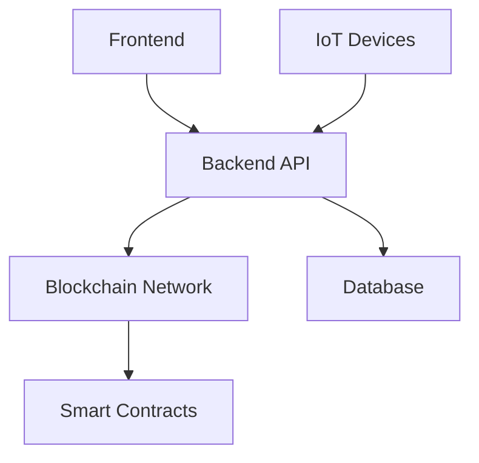

# System Architecture

## Components

1. **Blockchain Layer**
   - Ethereum-based smart contracts
   - IPFS for decentralized storage
   - Chainlink oracles for external data

2. **Frontend**
   - React.js PWA
   - Mapbox integration
   - Web3.js for blockchain interactions

3. **Backend**
   - Node.js/Express.js API
   - MongoDB Atlas cluster
   - Redis caching layer

## Data Flow
1. User reports disaster via mobile/web
2. API validates and stores in MongoDB
3. Critical data hashed to blockchain
4. Smart contracts trigger response protocols
5. Drones deployed via IoT integration
